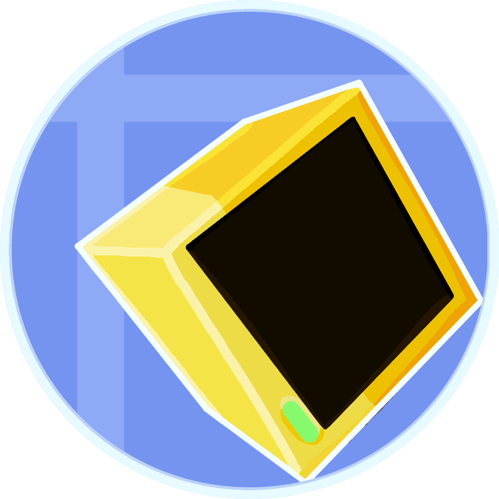

    

  <h1>CC:C Bridge</h1>  
  <h3>Adds compatibility between CC: Tweaked and Create through more peripherals!</h3>  

Available for `mc1.19.2` and `mc1.20.1` via (Neo)Forge and Fabric.
  <h1><!--Weird line separator to get a thinner line on GitHub--></h1>

### Description

While Create on its own has minimal support for CC: Tweaked, CC:C Bridge adds more peripheral blocks in addition, allowing for more ways to monitor and interact with Create's machines.

Using the Source- and Target Block, displayable information can be sent from or towards a Computer. This means that information like the current Stress Units can be precisely read and parsed, while other information from a Computer can be displayed on a Flip Display, Nixie Tube, Lectern or Sign.

In addition, other fun blocks have been added like the Animatronic, which lets you animate expressive and funny robot puppets, or the RedRouter, allowing to control redstone signals through one simple and infinitely long cables.

With these blocks, many things you always wanted to handle _precisely_ and _easily_ via Lua scripts are now possible!

<h1><!--Weird line separator to get a thinner line on GitHub--></h1>

### Documentation and Feedback

Guides for beginners as well as the API documentation can be found on [our wiki](https://cccbridge.tweaked-programs.cc).

If you found any bug or have an idea for a new feature, feel free to open a new issue on our [Issue Tracker on GitHub](https://github.com/tweaked-programs/cccbridge/issues)!

<h1><!--Weird line separator to get a thinner line on GitHub--></h1>

###### Copyright © 2025 Sammy L. Koch

###### CC:C Bridge is open software: you can redistribute it and/or modify it under the terms of the Apache License, version 2.0 only.

###### CC:C Bridge is distributed in the hope that it will be useful, but WITHOUT ANY WARRANTY; without even the implied warranty of MERCHANTABILITY or FITNESS FOR A PARTICULAR PURPOSE. See the Apache 2.0 License for more details.

###### You should have received a copy of the Apache 2.0 License along with this mod. If not, see <https://github.com/tweaked-programs/cccbridge/blob/mc1.20.1/COPYING.md>.
