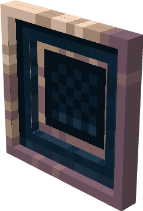

# Scroller Pane

{ align=left width="65" }
This peripheral is used by the **Scroller Pane**. It allows players to provide an input as an number inside the world. The interface can be manipulated.

The peripheral uses Create's NumberBehaviour selection screen. _(The same one you see whenever you e.g. adjust the speed on an **RotationalSpeedController**)_

## Metadata

| | |
|-|-|
| Peripheral | v2 |
| Attach name | `"scroller"` |

### Events

The RedRouter can send the following event:

| Name | Description | Parameter 1 | Parameter 2 |
|------|-------------|-------------|-------------|
| `"scroller_changed"` | Whenever the value got changed by a player.* | `string`: **attatched_name** | `number`: **new_value** |

!!! warning
    The event `"scroller_changed"` also fires when the value gets changed by an Computer. This is a bug that will be fixed!

---

## Functions

### `isLocked()`
Returns whether the Scroller Pane is locked or not.

**Returns**

 1. `boolean` The state

---

### `setLock(state)`
Unlocks the Scroller Pane with state = false (default) or state = true so that players cannot continue to use it.

**Parameters**

 1. `state`: [boolean](https://www.lua.org/manual/5.1/manual.html#2.2) Whenever the lock should be active or disabled.

---
### `getValue()`
Returns the selected value of the Scroller Pane.

**Returns**

 1. `number` The selected value.

---

### `setValue(value)`
Changes the selected value.

**Parameters**

 1. `value`: [number](https://www.lua.org/manual/5.1/manual.html#2.2) The new selected value.

---

### `getLimit()`
Returns the limit relative to zero.

**Returns**

 1. `number` The limit.

---

### `hasMinusSpectrum()`
Returns whenever the Scroller Pane has the minus spectrum enabled.

**Returns**

 1. `boolean` Returns `true` if the minus spectrum is enabled as well.

---

### `toggleMinusSpectrum(state)`
Enables or disables the minus spectrum.

**Parameters**

 1. `state`: [boolean](https://www.lua.org/manual/5.1/manual.html#2.2) `true` for enabled minus spectrum, `false` for the opposite.

---

### `setLimit(limit)`
Sets a new limit relative to zero.  
If the minus spectrum is enabled, the given limit then get's mirrored to the minus spectrum as well.

**Parameters**

 1. `limit`: [number](https://www.lua.org/manual/5.1/manual.html#2.2) The new limit.