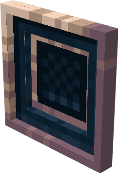

# Scroller Pane

{ align=right width="120" }

The **Scroller Pane** allows players to provide an input as an number within the world.

The peripheral uses Create's `NumberBehaviour` selection screen. _(The same one like on the **Rotational Speed Controller**)_. The interface can be manipulated by holding right click _(aka. interact)_ on the number and then moving the mouse cursor in the screen that opens up.

## Example

In order to use it, a modem has to be attached on its back. That means either placing a full modem block and placing the Scroller Pane _on it_, or using a temporarily block, placing the Scroller Pane on that, removing the temporarily block _and then_ using a normal modem on its back.

After that, we can start coding:

```lua
local scroller = peripheral.fid("scroller")

-- Let's lock it at the start to show
-- the player we are currently changing it, in this case.
scroller.setLocked(true)

-- If we have the minus spectrum enabled, half the limit.
local limit = scroller.hasMinusSpectrum() and 32 or 64

-- Apply the new limit.
-- If the minus spectrum is enabled, the limit will be from `-limit` to `limit`.
-- Otherwise it is from `0` to `limit`.
scroller.setLimit(limit)

scroller.setValue(32) -- Setting the current selected number.

sleep()
scroller.setLocked(false) -- We are done, give back player access

os.pullEvent("scroller_changed") -- Waiting until the player changes the value

```

Now, when we run this code, the scroller will first be locked, the limit and the default value will be changed and after that it gets unlocked again. The program however will wait until the Scroller Pane's value changes again.

You can play around with how it looks like with the minus spectrum being enabled or disabled again by putting this snippet in as well:

```lua
scroller.toggleMinusSpectrum(true)
```

---

## Metadata

| | |
|-|-|
| Peripheral | v2 |
| Attach name | `"scroller"` |
| Attach side | only `"back"` |

### Events

The Scroller Pane can send the following event:

| Name | Description | Parameter 1 | Parameter 2 |
|------|-------------|-------------|-------------|
| `"scroller_changed"` | Whenever the value got changed by a player. | `string`: **attached_name** | `number`: **new_value** |

---

## Functions

### `isLocked()`
Returns whether the Scroller Pane is locked or not.

**Returns**

 1. `boolean` The state

---

### `setLock(state)`
Unlocks the Scroller Pane with `state = false` (default) or locks it with `state = true` so that players cannot continue to use it.

**Parameters**

 1. `state`: [boolean](https://www.lua.org/manual/5.1/manual.html#2.2) Wether the lock should be active or disabled.

---
### `getValue()`
Returns the selected value of the Scroller Pane.

**Returns**

 1. `number` The selected value.

---

### `setValue(value)`
Changes the selected value.

**Parameters**

 1. `value`: [number](https://www.lua.org/manual/5.1/manual.html#2.2) The new selected value.

---

### `getLimit()`
Returns the limit relative to zero.

**Returns**

 1. `number` The limit.

---

### `hasMinusSpectrum()`
Returns wether the Scroller Pane has the minus spectrum enabled.

**Returns**

 1. `boolean` Returns `true` if the minus spectrum is enabled as well.

---

### `toggleMinusSpectrum(state)`
Enables or disables the minus spectrum.

**Parameters**

 1. `state`: [boolean](https://www.lua.org/manual/5.1/manual.html#2.2) `true` for enabled minus spectrum, `false` for the opposite.

---

### `setLimit(limit)`
Sets a new limit relative to zero.
If the minus spectrum is enabled, the given limit then get's mirrored to the minus spectrum as well.

**Parameters**

 1. `limit`: [number](https://www.lua.org/manual/5.1/manual.html#2.2) The new limit.
