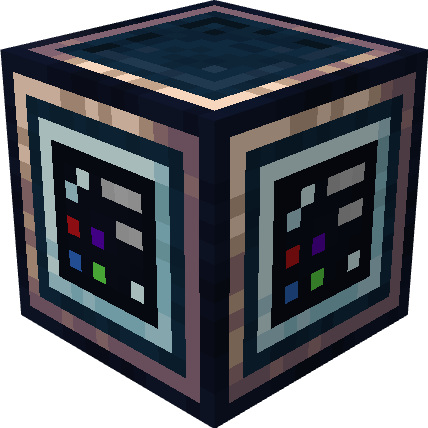

# Source Block

{ align=right width="120" }

The **Source Block** is used to _send_ data to **Create Display Targets**, like the Flap Display, Nixie Tubes, etc.

The peripherals API is identical to a _normal_ [Terminal](https://tweaked.cc/module/term.html), with some feature implementations from the [Window API](https://tweaked.cc/module/window.html). It does not support formatted text, meaing that `setBackgroundColor` and `setTextColor` will be ignored, although they are being provided as well.

## Example

As described above, it acts identical to a terminal:

```lua
local source = peripheral.find("create_source")
local width, height = source.getSize()

source.clear()

source.setCursorPos(width/2 - #("Hello World")/2, height/2)
source.write("Hello World")
```

In addition to that, `getLine` from the window API also can be used:

```lua
-- ...

local printed = source.getLine(height/2)
print(printed)
```

Different to the window API, however, it will only return one line, being the actual text, rather than three lines.

!!! info
    The update rate for whenever the text is being synced is 1 second. This can, however, be forced to update faster by using an redstone clock on the Display Link.

---

## Metadata

| | |
|-|-|
| Peripheral | v1.1 |
| Attach name | `"create_source"` |
| Attach side | all |

### Events

The RedRouter can send the following event:

| Name | Description | Parameter 1 |
|------|-------------|-------------|
| `"monitor_resize"` | Whenever the display targets size changes. | `string`: **attached_name** |
