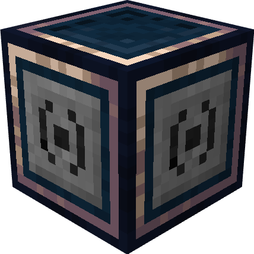

# Target Block

{ align=left width="100" }
This peripheral is provided by the **Target Block**. It is used to get data from **Create Display Sources**.

The peripheral only has some implementations from the [Window API](https://tweaked.cc/module/window.html) to receive data. It can't be manipulated much.

## Metadata

| | |
|-|-|
| Peripheral | v1.1 |
| Attach name | `"create_target"` |
| Attach side | all |

---

## Functions

### `setWidth(width)`
Sets the new width of the display. Cannot be larger than 164 chars.

**Parameters**

 1. `width`: [number](https://www.lua.org/manual/5.1/manual.html#2.2) The new width of the display.  

**Throws**

 1. Whenever the given number is not in the range `1` to `164`.  

---

### `clear()`
Clears the whole screen.

---

### `clearLine(y)`
Clears the line at the cursor position.

**Parameters**

 1. `y`: [number](https://www.lua.org/manual/5.1/manual.html#2.2) The `y` position of the to be cleared line.  

---

### `getLine(y)`
Returns the line at the wanted display position.

**Parameters**

 1. `y`: [number](https://www.lua.org/manual/5.1/manual.html#2.2) The `y` position on the display.  

**Returns**

 1. `string` The string from the given `y` position.  

**Throws**

 1. Whenever the given number is not in the range `1` to `<terminal height>`  

---

### `getSize()`
Returns the current display size.

**Returns**

 1. `number` The **width** of the **Target Block**.   
 2. `number` The **height** of the **Target Block**.  