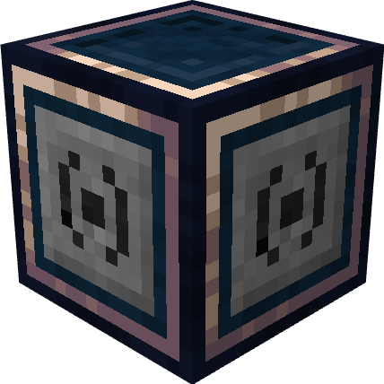

# Target Block

{ align=right width="120" }

The **Target Block** is used to _get_ data from **Create Display Sources**, like the Stressometer, items on belts, an Steam Engine, etc.

The peripheral only has _some_ implementations from the [Window API](https://tweaked.cc/module/window.html), to receive data. Besides the resolution, it cannot be manipulated really.

## Example

After connecting it to an Create source through its **Display Link** and attaching it via an modem to an computer, data can be read out:

```lua
local target = peripheral.find("create_target")

target.resize(32, 8) -- Determine the size of the terminal we provide.

-- Print every line we have:
for line in target.dump() do
    print(line)
end
```

The code above will dump its current text into the computers terminal. Alternatively, we can extract data from only a few certain lines for simplicity:

```lua
-- Reads out the current stress from the first line.
print("Stress: " .. target.getLine(1))
```

!!! info
    The update rate for new information is being controlled by the source. The rate can, however, be forced to update faster using an redstone clock on the Display Link.

---

## Metadata

| | |
|-|-|
| Peripheral | v1.2 |
| Attach name | `"create_target"` |
| Attach side | all |

---

## Functions

### `resize(width, height)`
Resizes the terminal.

**Parameters**

 1. `width`: [number](https://www.lua.org/manual/5.1/manual.html#2.2) The new width of the terminal.
2. `height`: [number](https://www.lua.org/manual/5.1/manual.html#2.2) The new height of the terminal.

**Throws**

 1. Whenever the given numbers are smaller than 1.

---

### `getLine(y)`
Returns the line at the wanted display position.

**Parameters**

 1. `y`: [number](https://www.lua.org/manual/5.1/manual.html#2.2) The `y` position on the display.

**Returns**

 1. `string` The string from the given `y` position.

**Throws**

 1. Whenever the given number is not in the range `1` to `<terminal height>`

---

### `dump()`
Returns the line at the wanted display position.

**Returns**

 1. `table` A table containing every line as an string, sharing all the same length and ordered.

---

### `getSize()`
Returns the current display size.

**Returns**

 1. `number` The **width** of the **Target Block**.
 2. `number` The **height** of the **Target Block**.
